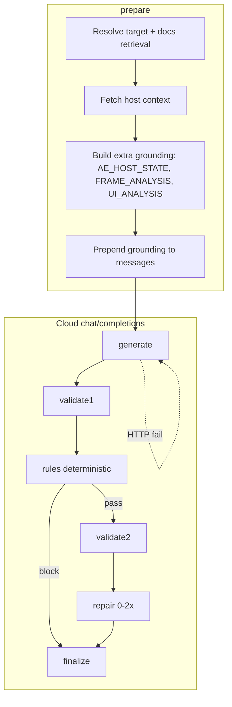

# Pipeline Runtime Flow

This document describes the stage sequence and model role assignment of the multi-pass pipeline implemented in Stage 3.

---

## End-to-end diagram (Send → cloud)



**Grounding** (before **generate**): system prompt → optional **`[AE_HOST_STATE]`** → docs KB context → optional **`[FRAME_ANALYSIS]`** (session) → optional **`[UI_ANALYSIS]`** (if checkbox) → target line → conversation. See **docs/vision-grounding.md**.

---

## Stage order

The pipeline runs in this order every time the user sends a request:

1. **prepare** — Resolve target (getResolvedTarget), run docs retrieval for the user message and target context. No model call. Status: "Preparing request…".

2. **generate** — One cloud call using **openai/gpt-oss-120b** (generator role). Produces a structured result: expression, assumptions, target_confirmation, self_check_status, self_check_notes. On HTTP/network or malformed response error, one retry with **Qwen/Qwen3-Coder-Next** (runtime fallback only). Status: "Generating expression…".

3. **validate1** — One cloud call using **openai/gpt-oss-120b** (validator role). Consumes the generated expression and target context; produces a structured report: status (pass|warn|fail), issues, fix_instructions, ae_invariants_checked, target_ok, explanation_for_user. Runtime fallback to Qwen on execution failure. Status: "Validating expression…".

4. **rules** — Deterministic, code-only checks (no LLM). Validates: non-empty expression, no leftover markers (---EXPLANATION---, ---NOTES---, code fences), sanitization compatibility, target context completeness. If any check fails, pipeline goes to finalize with disposition **blocked**. Status: "Applying checks…".

5. **validate2** — Second validator pass with **openai/gpt-oss-120b**, with context from the first report. Same report shape. Runtime fallback to Qwen on execution failure. Status: "Validating expression…".

6. **repair1 / repair2** — Only if validation (validate1 or validate2) reported fail, or both reported warn. Up to two repair passes using **Qwen/Qwen3-Coder-Next** (repair model). Each pass receives the current expression, issues, and fix_instructions; returns a corrected expression. After each repair, deterministic rules run again; if they still block, a second repair is attempted. Status: "Repairing expression…".

7. **finalize** — Decide disposition (acceptable | warned_draft | blocked), build the single display message, publish **only** that result to the chat transcript, set session.latestExtractedExpression (only when disposition is acceptable), update pipeline state and status line. Status: "Finalizing…", then "Completed successfully." / "Completed with warnings." / "Failed / blocked.".

---

## Model role assignment

| Role       | Model                    | When used                          |
|-----------|---------------------------|------------------------------------|
| Generator | openai/gpt-oss-120b       | generate                            |
| Validator | openai/gpt-oss-120b       | validate1, validate2                |
| Repair    | Qwen/Qwen3-Coder-Next     | repair1, repair2                    |
| Fallback  | Qwen/Qwen3-Coder-Next     | Only on HTTP/network/malformed response for generator or validator calls |

Semantic failure (e.g. validation fail or rules block) does **not** trigger model fallback; repair passes are used instead when validation or rules require fixes.

---

## Rules engine role

The rules stage is **deterministic** and **code-driven** (no LLM). It runs between validate1 and validate2. Order of checks:

1. Expression non-empty after trim.
2. **Sanitize** the expression (strip leading/trailing code fences, residual ---EXPLANATION---/---NOTES---, common labels).
3. If sanitization yields empty, **block**.
4. **After sanitization**, check for leftover wrapper markers or malformed formatting (---EXPLANATION---, ---NOTES---, ```) in the sanitized expression. If any remain, **block**.
5. **Source Text**: When target is Text > Source Text, if the expression uses `value.text` without a defensive check (e.g. `typeof value === 'string'` or `value && value.text`), **block** with a message — `value` may be a string in the expression engine and `value.text` can be undefined, causing TypeError.
6. Target context completeness when target is used.

If any check fails, the pipeline proceeds to finalize with disposition **blocked** and does not run validate2 or repair. The user sees a system message with the failure reason; no expression is stored for Apply. When all checks pass, the pipeline uses the **sanitized** expression (not the raw generator output) for validate2, repair, and final display, so harmless leading/trailing fences do not appear in the result.

---

## Status line and locking

- **isRequestInFlight** is set for the entire pipeline; Send and model selector stay disabled until the pipeline finishes (success or error).
- The status line is updated at each stage via **setPipelineStage(session, stage, status, userStatusText)**.
- Final status is set in **finalizePipelineState(session, disposition, statusText)** (e.g. "Completed successfully.", "Completed with warnings.", "Failed / blocked.").

See **docs/final-result-policy.md** for what is published to the chat and **docs/manual-apply-policy.md** for Apply behavior.
